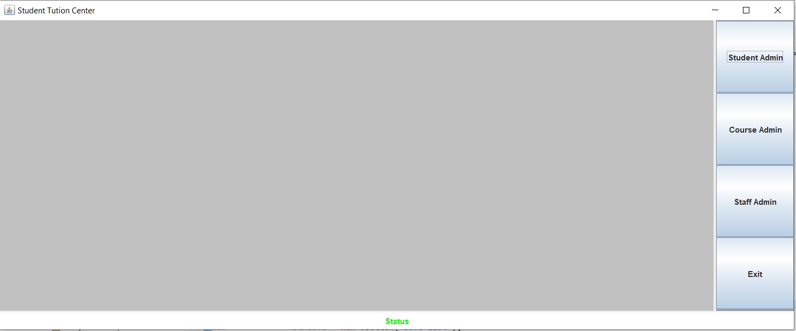
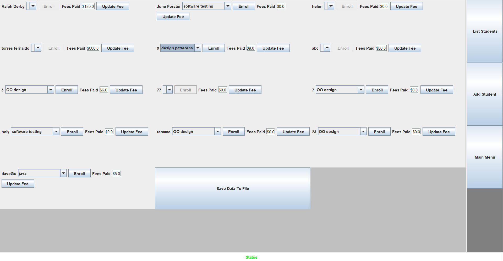

# StudentGui
#How the system works?
It loads 3 files in startup as students, courses and staff. 
Student admin can list all the students with option to enroll a course from
combo box and update tuition fee.
Course admin can list all the enrolled students with studentId and grade for a course selected from a combo box.

Home screen:

Student Admin screen:
